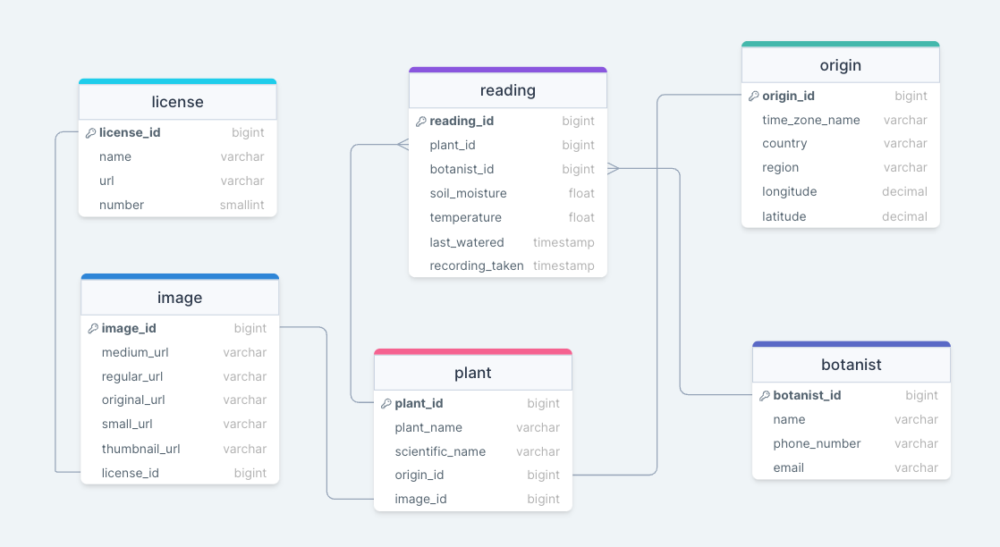

# LNHM Plant Sensor Project
This stores the group project work for the plant project in W12.

## Entity Relationship Diagram (ERD)

The relational database used for short-term storage is in 3rd Normal Form, as the data extracted from the API is structured and there is a clear but complex relationship between the entities.

The database must be updated with a large number of frequent real-time transactional operations every minute, thus a database model favouring online transactional processing was chosen. This will provide a good balance between data integrity and flexibility.

## Architecture Diagram

## Assumptions Log

Extract:
- Valid plant ids in range 0-51 (higher plant id's consistently return 'plant not found' error.)
- Origin_location, image info, name and scientific names are assumed to be static.

Databases:
- Short term databases - contains only the changing data
- Long term database - contains all information, and it seeded with the static data.
  - The data from the short term database will be inserted into the long-term database every 24 hours.
