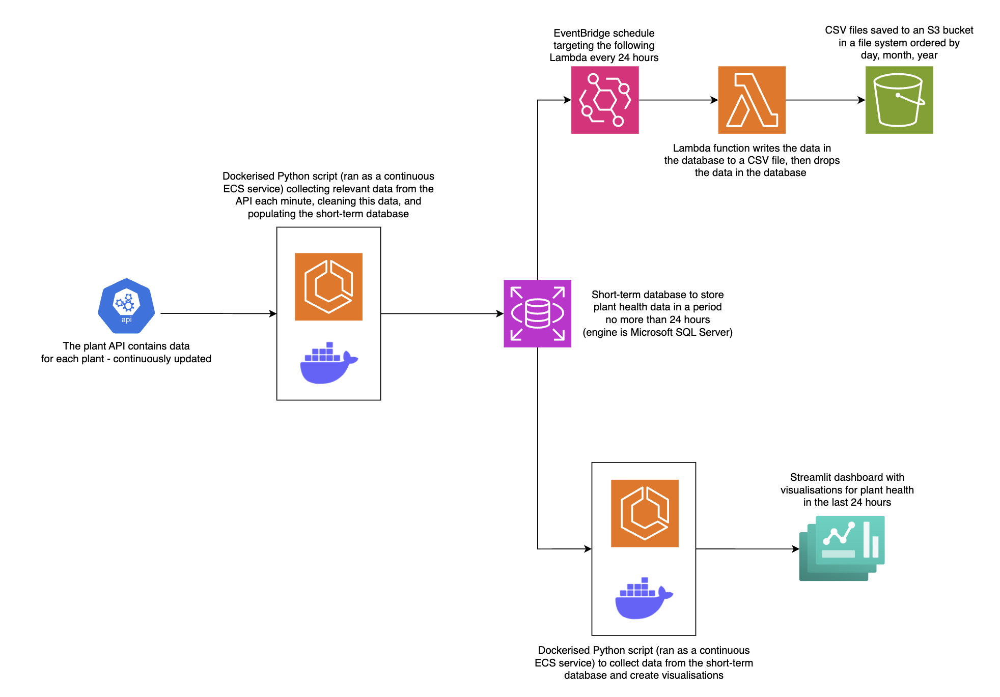
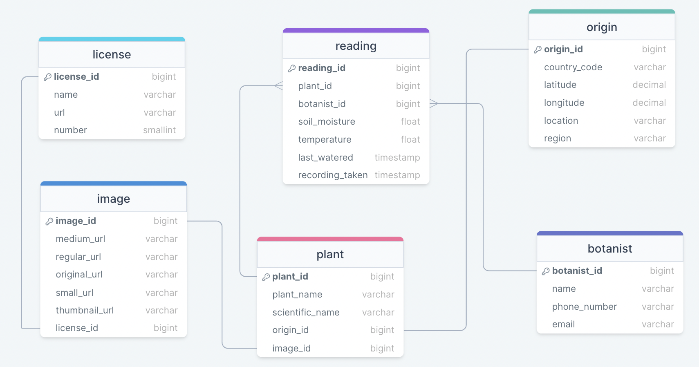

# LNHM Plant Sensor Project

## Project Description
This project contains a Python ETL pipeline for the Liverpool National History Museum (LNHM) to monitor the health of the plants over time. Data is extracted from an API streaming live readings from an array of sensors setup to monitor the health of the plants.

The project deliverables are:
- A full data pipeline, hosted in the cloud.
- A short term database solution that can store the data for the past 24 hours.
- A long term storage solution for all data older than 24 hours.
- A dashboard containing graphs of the latest temperature and moisture readings for every plant.

## Architecture

### Architecture Diagram

The main ETL pipeline Python script extracts data from the plant API, cleans the data, and loads the data into the database. The script is Dockerised and ran as a continuous service on AWS ECS. The aim here is to monitor the plant health as close to every minute as possible. If one iteration of passing data through the pipeline takes longer than one minute (largely due to response times in communicating with the API), then the next iteration begins immediately. Otherwise, if the current iteration takes less than one minute to complete, the next iteration begins after one minute has passed from the start of the current iteration.

Our chosen long-term storage solution is AWS S3, as it is an easy, scalable and cost-effective way to store the plant health data long-term. The data is stored in CSV-format with the CSV file containing all the data collated in the previous 24 hours, which comes from short-term RDS storage. AWS EventBridge provides an easy way to trigger this every 24 hours, whilst a Lambda function is chosen to implement this transfer, as it is lightweight and relatively infrequent.

In addition to the pipeline, the Python script running a Streamlit dashboard is configured as a continuous service on ECS. The script connects to the database and utilises the data contained in the database to create visualisations which provide insights into the health of each plant in the museum at any given moment.

### Entity Relationship Diagram (ERD)

The relational database used for short-term storage is in 3rd Normal Form, as the data extracted from the API is structured and there is a clear but complex relationship between the entities.

The database must be updated with a large number of frequent real-time transactional operations every minute, thus a database model favouring online transactional processing was chosen. This will provide a good balance between data integrity and flexibility.

The static data from the API is seeded into the database tables upon their creation using a CSV containing a complete dataset of the static information. The tables seeded are the origin, botanist, license, image and plant tables.

This approach increases the speed of pipeline by allowing it to only process the dynamic data to insert into the reading table.

### Terraform

Contained inside the terraform folder are two files: `main.tf` and `variables.tf`, the first contains all terraform code used to create all aws cloud infrastructure utilised, the latter contains the names of variables used in creating the infrastructure. The variables are sensitive so in re-creating this project, an additional file named `terraform.tfvars` should be created containing the specific values for these variables. Do not share the information stored in this file. 

The `main.tf` file will create all infrastructure although to get the project up and running from this, you will need to upload the required Docker images to ECR repositories. Following this, all functionality should work as intended.

## Setup

### Pipeline

1. Navigate to the directory you wish to create a repository
2. Activate a `venv`
3. Clone the repo
`git clone https://github.com/tadawson23/plant_project_LMNH_CC.git`
4. Install Python packages
`pip3 install -r requirements.txt`
5. Create an `.env` file containing the following:
   
For uploading data to the database:
- `DB_NAME`
- `DB_USER`
- `DB_HOST`
- `DB_PASSWORD`
- `DB_PORT`
  
For connecting to the S3 bucket:
- `AWS_ACCESS_KEY_ID`
- `AWS_SECRET_ACCESS_KEY`

### Microsoft SQL Server

- To install the command-tool: `brew install sqlcmd`
- Activate a `venv` in the directory where the database will be accessed.
- Run the following sequence of shell commands to set things up:
`brew install FreeTDS
export CFLAGS="-I$(brew --prefix openssl)/include"
export LDFLAGS="-L$(brew --prefix openssl)/lib -L/usr/local/opt/openssl/lib"
export CPPFLAGS="-I$(brew --prefix openssl)/include"
pip install --pre --no-binary :all: pymssql --no-cache
pip install sqlalchemy`

#### Usage - sqlcmd
- `sqlcmd -S [host],[port] -U [user] -P [password]` is the basic connection line
- `exit` to quit the interpreter
- Add `go` after every command to actually run them
- `-i [filename] `on the end of the connection line to run a file
- `-c [command]` on the end of the connection line to run a file

### Database

1. To connect to the database schema, run in the terminal:
`sqlcmd -S [host],[port] -U [user] -P [password];
USE plants;
GO;`

3. Run the commands contained in the `seed_db.sql` script in the terminal to setup the tables in the database.

4. To seed the database with static data, run in the terminal:
`python3 load_static_data.py`.

### Dashboard

Inside the dashboard folder contains the main `dashboard.py` script which uses the streamlit library to create some visualisations giving insight into the health of each plant at the current time, as well as in the past. To run the dashboard locally, navigate to the dashboard directory and run the following command in the terminal: `streamlit run dashboard.py`.

Alternatively, the dashboard is running on the cloud, and can be accessed from your browser using its public IP and specifying the inbound traffic port number: http://3.10.217.84:8501/

The dashboard lets users see raw data collected in any given day, filtering by each plant, as well as visualisations giving insight into the soil moisture and temperature readings for each plant, again, from either past or present data. 

## Assumptions Log

Extract:
- Valid plant ids in range 0-51 (higher plant id's consistently return 'plant not found' error.)
- Origin_location, image info, name and scientific names are assumed to be static.

- The database is hard-coded with static values, which applies to the following databases:
  - Botanist
  - Plant
  - License
  - Origin
  - Image

- Transient values are added to the database, for each plant, every minute.
- Only data extracted within the last 24 hours is held in the database and used for the dashboard.
- After 24 hours, the data is stored in an S3 bucket and the database is wiped.

Transform:
- Soil moisture and temperature have a precision of 2 decimal places.
- Any rows which contain an error regardless of the type of error is removed from data.
- Records containing invalid soil moisture or temperature, for example negative values, are omitted.

- All valid data will be stored in long-term S3 bucket and not omitted, due to potential change of requirements in the future.
